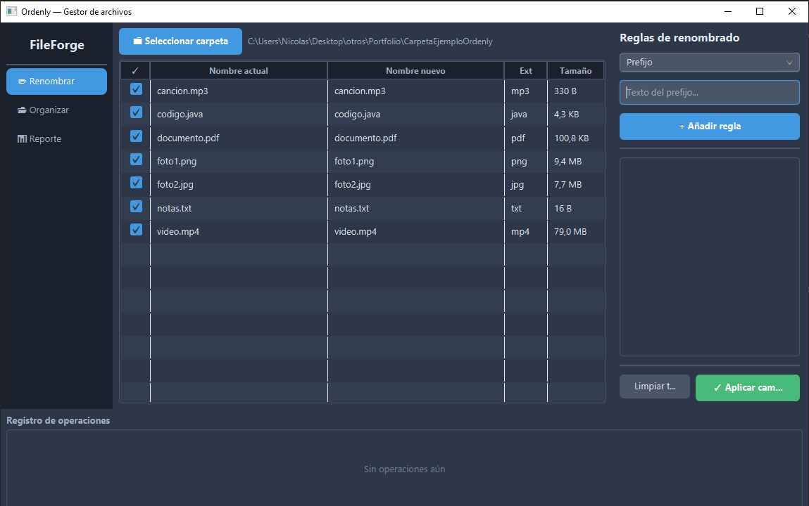
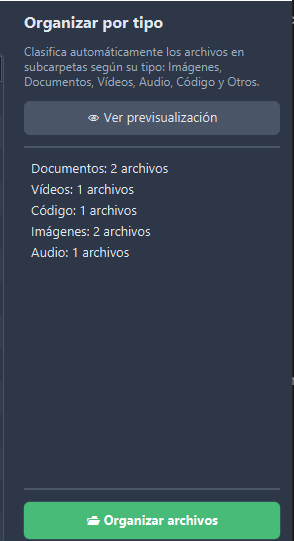
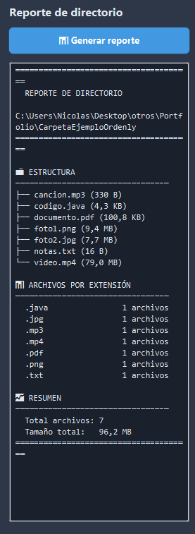

# Ordenly — Gestor de archivos de escritorio

Aplicación de escritorio para procesamiento masivo de archivos: renombrado por lotes con reglas configurables, organización automática por tipo y generación de reportes de directorio.

## Capturas

<!-- TODO: Añadir capturas reales de la app -->
| Modo renombrar | Modo organizar | Reporte |
|---|---|---|
|  |  |  |

## Stack tecnológico

- **Java 17+** — Lenguaje principal (OOP, streams, NIO.2)
- **JavaFX 21** — Framework de interfaz gráfica
- **Gradle** — Sistema de build
- **Shadow plugin** — Generación de JAR ejecutable (fat JAR)

## Funcionalidades

### Renombrado por lotes
- 5 tipos de reglas combinables: prefijo, sufijo, buscar/reemplazar, secuencia numérica, prefijo con fecha
- Previsualización en tiempo real (columna "Nombre nuevo" en verde)
- Validación de colisiones antes de ejecutar
- Confirmación con diálogo antes de aplicar

### Organización automática
- Clasifica archivos en subcarpetas por tipo: Imágenes, Documentos, Vídeos, Audio, Código, Otros
- Previsualización del conteo por categoría antes de organizar
- Crea las subcarpetas automáticamente

### Reporte de directorio
- Genera árbol visual de la estructura del directorio
- Conteo de archivos por extensión
- Tamaño total formateado

### General
- Tema oscuro completo con CSS personalizado
- Registro de todas las operaciones realizadas
- Selección individual de archivos con checkbox
- Diálogos de confirmación para operaciones destructivas

## Arquitectura

```
src/main/java/com/ordenly/
├── App.java                # Entry point JavaFX
├── models/
│   ├── FileItem.java       # Modelo de archivo con nombre original/nuevo
│   ├── RenameRule.java     # Interface + 5 implementaciones de reglas
│   └── OperationLog.java   # Registro de operación con timestamp
├── services/
│   ├── FileScanner.java    # Escaneo de directorio con NIO.2 streams
│   ├── RenameService.java  # Preview + ejecución de renombrado
│   ├── OrganizerService.java # Clasificación por tipo de archivo
│   └── ReportService.java  # Generación de reportes con árbol visual
├── viewmodels/
│   └── MainViewModel.java  # Estado observable con JavaFX Properties
├── views/
│   ├── MainView.java       # Layout principal (BorderPane + sidebar)
│   ├── FileTableView.java  # Tabla de archivos con columnas dinámicas
│   ├── RenamePanel.java    # Panel de configuración de reglas
│   ├── OrganizePanel.java  # Panel de organización con preview
│   └── LogPanel.java       # Panel de registro de operaciones
└── utils/
    └── FileUtils.java      # Formateo de tamaño + categorías de archivos
```

**Patrón:** MVVM simplificado — el ViewModel expone `ObservableList` y `Property` que las vistas observan mediante bindings de JavaFX.

## Cómo ejecutar

### Requisitos previos
- JDK 17 o superior instalado ([descargar](https://www.oracle.com/java/technologies/downloads/))

### Pasos

```bash
# Clonar el repositorio
git clone https://github.com/NickBullicik/ordenly.git
cd ordenly

# Compilar y ejecutar
./gradlew run

# Generar JAR ejecutable
./gradlew shadowJar

# Ejecutar el JAR
java -jar build/libs/ordenly-all.jar
```

## Paleta de colores

| Elemento | Color |
|---|---|
| Fondo principal | `#2D3748` |
| Sidebar | `#1A202C` |
| Texto principal | `#E2E8F0` |
| Acento (azul) | `#4299E1` |
| Éxito (verde) | `#48BB78` |
| Peligro (rojo) | `#FC8181` |

## Autor

Nicolás Mazzilli — [GitHub](https://github.com/NickBullicik)
